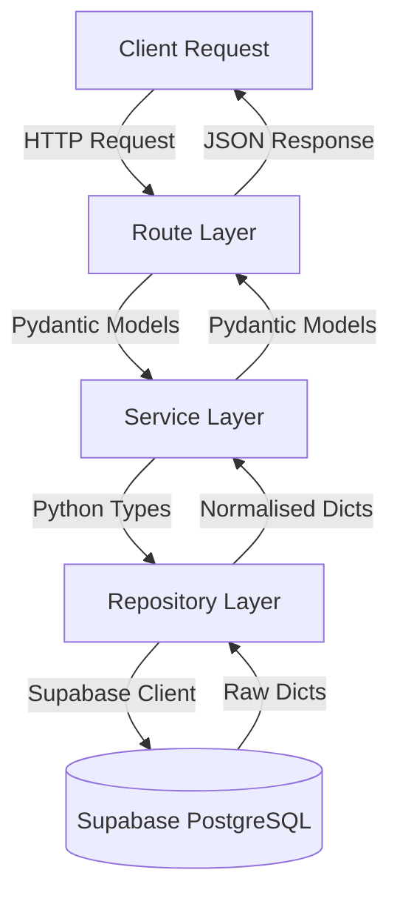

# Architecture — TN Board Portal

> Last updated: 2026-08-08 · Version: 2.0.0

---

## High-Level Overview

TN Board Portal runs on a **unified Vercel deployment**:

- **Frontend:** React SPA built with Vite and Tailwind CSS.
- **Backend:** FastAPI application (Python) deployed via Vercel Serverless Functions (`api/index.py`).
- **Database & Storage:** Supabase Platform (PostgreSQL + Storage).
- **Authentication:** Firebase Admin SDK & Firebase Auth.

```mermaid
graph TD
    User[User Browser] -->|Routes /* & /api/*| Vercel[Vercel Unified Deployment]
    subgraph Vercel
        Vercel -->|SPA Frontend| ReactSPA[React SPA / Vite]
        Vercel -->|Serverless /api/*| FastAPI[FastAPI Backend api/index.py]
    end
    FastAPI -->|PostgREST & Storage| Supabase[(Supabase DB & Storage)]
    FastAPI -->|Token Verification| FirebaseAuth[(Firebase Auth)]
```


---

## Backend Architecture

The backend is built with FastAPI and follows a strict, four-layer architecture to separate concerns, ensure testability, and keep the API surface thin.

### Architectural Layers



### 1. Route Layer (`app/api/v1/endpoints/`)
**Responsibility:** HTTP request and response handling.
- Validates path and query parameters using FastAPI type hints.
- Delegates all business logic to the Service layer.
- Returns formatted responses using Pydantic models.
- **Rule:** Never interacts with the database directly. Never contains business logic.

### 2. Service Layer (`app/services/`)
**Responsibility:** Business logic and domain rules.
- Acts as the core logic engine between Routes and Repositories.
- Handles tasks like search term expansion, sorting decisions, and entity relationships.
- Throws specific domain exceptions (e.g., `NotFoundError`) which are caught by FastAPI's exception handlers.
- **Rule:** Contains no HTTP-specific code (e.g., no `Request`, `Response`, or HTTP status codes).

### 3. Repository Layer (`app/repositories/`)
**Responsibility:** Data access and Supabase interactions.
- Encapsulates all interactions with the Supabase PostgREST API and RPCs.
- Contains all query configurations, table selections, and filters.
- Normalizes raw database responses into clean Python dictionaries.
- **Rule:** This is the *only* layer allowed to use the `supabase.Client`. No business logic (like search term generation) is allowed here.

### 4. Database Layer (Supabase)
**Responsibility:** Data storage and advanced querying.
- Exposes data via PostgREST for standard CRUD operations.
- Uses Remote Procedure Calls (RPCs) for complex atomic operations (e.g., `increment_download_count`, `search_papers`).

---

## Data Flow & Models

The backend utilizes **Pydantic** (`app/schemas/`) heavily to enforce typing and consistency.

1. A request comes in and is validated by the Route against FastAPI/Pydantic schemas.
2. The Route instantiates a Service (passing the `Client` dependency) and calls a domain method.
3. The Service calls the corresponding Repository method.
4. The Repository executes a query via the Supabase client and returns raw dicts.
5. The Service maps the raw dicts into the expected Pydantic schema models.
6. The Route returns the Pydantic models, which FastAPI serializes to JSON.

## Exception Handling

Errors are centralized using custom exceptions defined in `app/utils/exceptions.py`.

- `NotFoundError` (404)
- `ValidationError` (422)
- `DatabaseError` (500)

These custom exceptions inherit from `fastapi.HTTPException` allowing FastAPI to natively capture them and respond with standard JSON structure (`{"detail": "..."}`). Additionally, a global exception handler in `main.py` catches completely unhandled errors, ensuring no stack traces leak to the client and returning a standardized 500 error.

---

## Project Structure

```
tn-board-portal/
├── backend/
│   ├── app/
│   │   ├── api/v1/          # Route Layer (router.py and endpoints/)
│   │   ├── config/          # Configuration (settings.py)
│   │   ├── dependencies/    # FastAPI Dependencies (e.g., get_db)
│   │   ├── repositories/    # Repository Layer
│   │   ├── schemas/         # Pydantic Models
│   │   ├── services/        # Service Layer
│   │   ├── utils/           # Shared utilities (exceptions.py)
│   │   └── main.py          # Application Entry Point
│   ├── tests/               # Test suites
│   └── requirements.txt     # Python Dependencies
├── frontend/                # React SPA
├── supabase/                # Migrations and SQL Scripts
└── docs/
    └── ARCHITECTURE.md      # This file
```

---

## Database Schema

### Tables

| Table | Purpose | PK |
|---|---|---|
| `classes` | School classes 9–12 | `id INTEGER` |
| `subjects` | Subjects per class | `id SERIAL` |
| `papers` | Question papers and answer keys | `id SERIAL` |
| `official_notices` | Circulars, timetables, government orders | `id SERIAL` |
| `news_updates` | Education news, exam updates | `id UUID` |
| `audit_logs` | Immutable admin action history | `id SERIAL` |
| `search_queries` | Analytics: every public search term | `id SERIAL` |

### PostgreSQL RPC Functions

| Function | Called By | Purpose |
|---|---|---|
| `search_papers(q, p_class_id, p_exam_type, p_paper_type)` | `papers_repository.py` | Multi-table ILIKE search over papers |
| `search_notices(q, p_category, p_class_id, p_year)` | `frontend/services/search.js` | ILIKE search over notices |
| `search_news(q, p_category, p_limit)` | `frontend/services/search.js` | ILIKE search over news |
| `get_admin_stats()` | `frontend/services/admin.js` | Aggregate statistics for dashboard |
| `increment_download_count(paper_id)` | `papers_repository.py` | Atomic download counter increment |
| `record_notice_view(id)` | `frontend/services/notices.js` | Notice view counter |
| `record_notice_download(id)` | `frontend/services/notices.js` | Notice download counter |
| `increment_news_views(id)` | `frontend/services/news.js` | News view counter |

---

## Supabase Storage Buckets

| Bucket | Public | Max File Size | Accepted MIME Types |
|---|---|---|---|
| `papers` | ✅ | Configured in Supabase | `application/pdf` |
| `official-updates` | ✅ | 50 MB | All types (PDF, image, Office docs) |
| `news-media` | ✅ | 20 MB | JPEG, PNG, WebP, GIF, PDF |

All buckets use:
- **Public SELECT** policy for `anon`
- **Authenticated INSERT / DELETE** policy for `authenticated`
